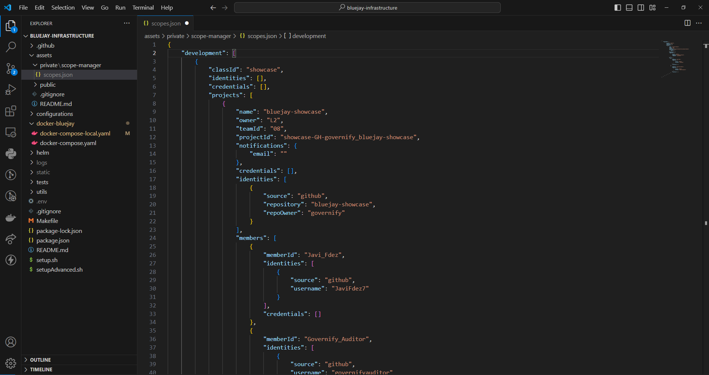
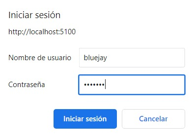
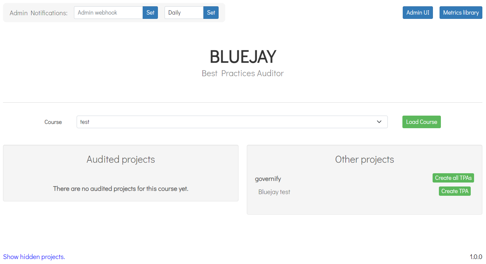

# Docker Compose Deployment - Quickstart version

---

This guide deploys bluejay with the docker ecosystem in a local/development environment. For a more advanced deployment please refer to [Docker Compose](./docker-compose.md).

## Prerequisites
- Windows OS, Linux or macOS with the following installed packages:
   - docker
   - docker-compose (version 1.27 or greater)
- Ports 80, 443 open on the server.

:::info
Most of Bluejay's Docker images are built using the linux/amd64 platform. If using a computer with an ARM processor (such as a Mac with Apple Silicon), see more details in [section 4](#4-deploy-with-docker-compose) below.
:::

## 1. Clone Repo
Clone latest release of [Bluejay Infrastructure repository](https://github.com/governify/bluejay-infrastructure):
```
git clone https://github.com/governify/bluejay-infrastructure.git
```
## 2. Add '.env' file
The `.env` file is used to configure environmental variables used in your specific deployment. The content of this file must be the following:
```yaml
# GENERAL (Mandatory for deployment)

GOV_INFRASTRUCTURE=http://host.docker.internal:5200/api/v1/public/infrastructure-local.yaml 
# For service registry

NODE_ENV=development 
# Development environment


# Repository branch
ASSETS_REPOSITORY_BRANCH=develop 
# Repository of static files

# Influx database url
INFLUX_URL=http://host.docker.internal:5002

# Event collector
KEY_GITHUB=<key> 
# In the section below we will specify how to generate this token

# Frontends access account
USER_RENDER=bluejay
PASS_RENDER=bluejay
USER_ASSETS=bluejay
PASS_ASSETS=bluejay
# Here you can stablish the credentials to acces Bluejay's frontend

# Assets manager
KEY_ASSETS_MANAGER_PRIVATE=bluejay-assets-private-key
# Internal key

# Scope manager
KEY_SCOPE_MANAGER=bluejay-scopes-private-key
# Internal key

# Compose config
COMPOSE_HTTP_TIMEOUT=200
```
### 2.1 Create Github token
Generating a Github token is an essential step. With this key Blujay is able to communicate with the app to retrieve information about the repository that you want to audit. This token is not generated in any specific repo, it serves as a personal private API key in your account.
- Navigate to your github account and then go to  `Settings>Developer Settings` (at the end of the menu).
- Go to `Personal access tokens > Tokens (classic)`
- Click on `Generate new token > Generate new token (classic)` 
- The scopes you select are up to you, but you need at least repository access.
- Click on `Generate token` and make sure to copy the given key and paste it into `KEY_GITHUB` in the `.env` file.

## 3. Create scopes.json
Within the `assets/private/scope-manager` directory, you will discover a file named `scopes.json.example`. This file serves as a blueprint, guiding us in the creation of our custom `scopes.json`, which will be located within the same directory as the example. You can copy the following contents into your scopes file as a test.
```json
{
    "development": [
        {
            "classId": "showcase",
            "identities": [],
            "credentials": [],
            "projects": [
                {
                    "name": "bluejay-showcase",
                    "owner": "L2",
                    "teamId": "08",
                    "projectId": "showcase-GH-governify_bluejay-showcase",
                    "notifications": {
                        "email": ""
                    },
                    "credentials": [],
                    "identities": [
                        {
                            "source": "github",
                            "repository": "bluejay-showcase",
                            "repoOwner": "governify"
                        }
                    ],
                    "members": [
                        {
                            "memberId": "Javi_Fdez",
                            "identities": [
                                {
                                    "source": "github",
                                    "username": "JaviFdez7"
                                }
                            ],
                            "credentials": []
                        },
                        {
                            "memberId": "Governify_Auditor",
                            "identities": [
                                {
                                    "source": "github",
                                    "username": "governifyauditor"
                                }
                            ],
                            "credentials": []
                        }
                    ]
                }
            ]
        }
    ]
}
```
If you modify this file to add more projects or make any change, you will have to restart the `render` and `scope-manager` containers.


The scope directory should look like this:

## 4. Deploy with Docker Compose
Now we can deploy the system with the following command:
```
docker-compose -f docker-bluejay/docker-compose-local.yaml --env-file .env up -d 
```

:::info
If using a computer with an ARM processor, modify the `version` in the docker-compose-local.yaml file to `2.4` and add `platform: linux/amd64` to each service that fails to launch. Alternatively, set the environment variable `DOCKER_DEFAULT_PLATFORM` to `linux/amd64`.
:::

Navigate to localhost:5100 to access the main page of Bluejay. A prompt like the following will pop up in your browser, where have to input the `USER_RENDER` and `PASS_RENDER` values specified in the `.env` file:



Governify ecosystem with bluejay services should have been deployed in your machine.

To stop the containers use:
```bash
docker-compose -f docker-bluejay/docker-compose-local.yaml --env-file .env stop
``` 

You can easily restart them using:
```bash
docker-compose -f docker-bluejay/docker-compose-local.yaml --env-file .env start
``` 

If you made a change in the configuration you will have to re-compose the containers using `down`and then using `up` or `up -d` again:

```bash
docker-compose -f docker-bluejay/docker-compose-local.yaml --env-file .env down # stop and remove containers

docker-compose -f docker-bluejay/docker-compose-local.yaml --env-file .env up -d # deploy
``` 

## 5. Posting a TPA for the project and generating the first points
You can find more information about that in [Local TPA Creation Quickstart](../tpa-creation)
