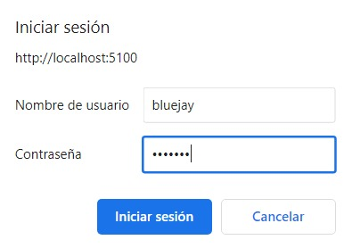

# Docker Compose Deployment

---

This guide deploys bluejay with the docker ecosystem in a local/development environment. During this guide the system is deployed with docker, a class is created, a TPA is created for that class and a calculation is carried out to display the first points on the graphs.

## Prerequisites
- Windows OS, Linux or macOS with the following installed packages:
   - docker
   - docker-compose (version 1.27 or greater)
- Ports 80, 443 open on the server.
- In case you are running a linux machine, you need to asociate the host.docker.internal url to 172.17.0.1 (docker's gateway)
```ssh
host-manager -add host.docker.internal 172.17.0.1
```

:::info
Most of Bluejay's Docker images are built using the linux/amd64 platform. If using a computer with an ARM processor (such as a Mac with Apple Silicon), see more details in [section 4](#4-deploy-with-docker-compose) below.
:::

## 1. Clone Repo
Clone latest release of [Bluejay Infrastructure repository](https://github.com/governify/bluejay-infrastructure):
```
git clone https://github.com/governify/bluejay-infrastructure.git
```
## 2. Add '.env' file
The `.env` file is used to configure environmental variables used in your specific deployment. The content of this file must be the following:
```yaml
# GENERAL (Mandatory for deployment)

GOV_INFRASTRUCTURE=http://host.docker.internal:5200/api/v1/public/infrastructure-local.yaml 
# For service registry

NODE_ENV=development 
# Development environment


# Repository branch
ASSETS_REPOSITORY_BRANCH=develop 
# Repository of static files

# Influx database url
INFLUX_URL=http://host.docker.internal:5002

# Event collector
KEY_GITHUB=<key> 
# In the section below we will specify how to generate this token

# Frontends access account
USER_RENDER=bluejay
PASS_RENDER=bluejay
USER_ASSETS=bluejay
PASS_ASSETS=bluejay
# Here you can stablish the credentials to acces Bluejay's frontend

# Assets manager
KEY_ASSETS_MANAGER_PRIVATE=bluejay-assets-private-key
# Internal key

# Scope manager
KEY_SCOPE_MANAGER=bluejay-scopes-private-key
# Internal key

# Compose config
COMPOSE_HTTP_TIMEOUT=200
```
### 2.1 Create Github token
Generating a Github token is an essential step. With this key Blujay is able to communicate with the app to retrieve information about the repository that you want to audit. This token is not generated in any specific repo, it serves as a personal private API key in your account.
- Navigate to your github account and then go to  `Settings>Developer Settings` (at the end of the menu).
- Go to `Personal access tokens > Tokens (classic)`
- Click on `Generate new token > Generate new token (classic)` 
- The scopes you select are up to you, but you need at least **repository**, **project** and **user** access.
- Click on `Generate token` and make sure to copy the given key and paste it into `KEY_GITHUB` in the `.env` file.

## 3. Deploy with Docker Compose
Now we can deploy the system with the following command:
```
docker-compose -f docker-bluejay/docker-compose-local.yaml --env-file .env up -d 
```

:::info
If using a computer with an ARM processor, modify the `version` in the docker-compose-local.yaml file to `2.4` and add `platform: linux/amd64` to each service that fails to launch. Alternatively, set the environment variable `DOCKER_DEFAULT_PLATFORM` to `linux/amd64`.
:::

Navigate to localhost:5100 to access the main page of Bluejay. A prompt like the following will pop up in your browser, where have to input the `USER_RENDER` and `PASS_RENDER` values specified in the `.env` file:


Governify ecosystem with bluejay services should have been deployed in your machine.

## 4. Create scopes.json
Within the `assets/private/scope-manager` directory, you will discover a file named `scopes.json.example`. This file serves as a blueprint, guiding us in the creation of our custom `scopes.json`, which will be located within the same directory as the example. You can copy the following contents into your scopes file as a test, although the `scopes.json.example` file already includes this content. We will use a test repository to audit our first project and which you can find on github: [bluejay-showcase](https://github.com/governify/bluejay-showcase)
```json
{
    "development": [
        {
            "classId": "showcase",
            "identities": [],
            "credentials": [],
            "projects": [
                {
                    "name": "bluejay-showcase",
                    "owner": "L2",
                    "teamId": "08",
                    "projectId": "showcase-GH-governify_bluejay-showcase",
                    "notifications": {
                        "email": ""
                    },
                    "credentials": [],
                    "identities": [
                        {
                            "source": "github",
                            "repository": "bluejay-showcase",
                            "repoOwner": "governify"
                        }
                    ],
                    "members": [
                        {
                            "memberId": "Javi_Fdez",
                            "identities": [
                                {
                                    "source": "github",
                                    "username": "JaviFdez7"
                                }
                            ],
                            "credentials": []
                        },
                        {
                            "memberId": "Pablo_Fdez",
                            "identities": [
                                {
                                    "source": "github",
                                    "username": "pafmon"
                                }
                            ],
                            "credentials": []
                        }
                    ]
                }
            ]
        }
    ]
}
```

The scope directory should look like this:


Now you have to restart the `scope-manager` container in docker. Once restarted you will be able to view the showcase project in the user interface


### 5. Useful commands and information
If you modify the scopes.json to add more projects or make any change after deploying the ecosystem, you will have to restart the `scope-manager` container.

To stop the containers use:
```bash
docker-compose -f docker-bluejay/docker-compose-local.yaml --env-file .env stop
``` 

You can easily restart them using:
```bash
docker-compose -f docker-bluejay/docker-compose-local.yaml --env-file .env start
``` 

If you made a change in the configuration you will have to re-compose the containers using `down`and then using `up` or `up -d` again:

```bash
docker-compose -f docker-bluejay/docker-compose-local.yaml --env-file .env down # stop and remove containers

docker-compose -f docker-bluejay/docker-compose-local.yaml --env-file .env up -d # deploy
``` 

## 6. Create a new TPA for the project
The TPA you are going to create provides information about the number of issues in progress that the members of the repository have in the project. You can find the complete TPA in the [zoo repository](https://github.com/governify/zoo/blob/main/bluejay/tpa/showcase/v1.1/tpa-showcase-v1.1.json).

In the user interface, click on the project's Create TPA button located under Other Projects


You have now created the TPA for the test project. This is what you will see in the user interface. It is time to compute this TPA to see how the work team is performing.


## 7. Compute the TPA
From the user interface, we click on the TPA button in the project and access the TPA details. In this new menu we click on Calculate Metrics. We enter the time and date you are currently on (take into account the time zone and enter exactly 1 hour (59 minutes and 59 seconds) for this test) and click on compute.


 Now you must wait about 10 seconds or access the reporter logs, which will notify you when the elements have been inserted into the graphs.

Then access the dashboard with the following credentials:
- User: **governify-admin**
- Password: **governify-project** 

And see the information that has been generated according to the data from the github repository


## 8. Next Steps
For more information on how a TPA works, visit our documentation on [TPA configurations](/customization/agreement-modeling/team-practices-agreements).

If you want to know the complete architecture of the ecosystem, visit the [governify architecture documentation](https://docs.governify.io/architecture/intro).

If you find any errors or want to propose any improvements to the documentation, follow this [contribution guide](https://docs.governify.io/development/contributing/contributing-to-docs)