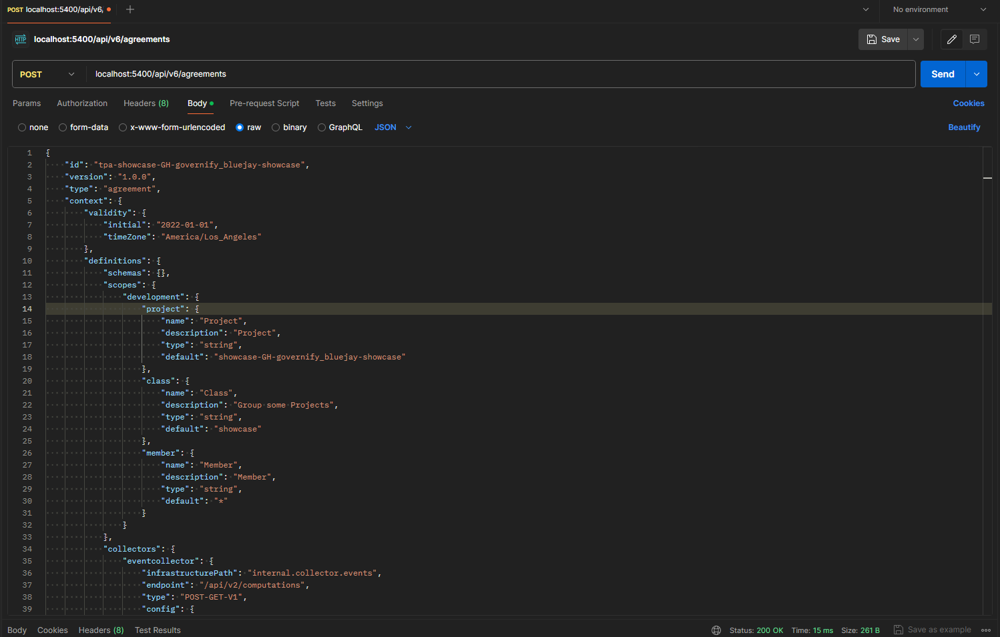
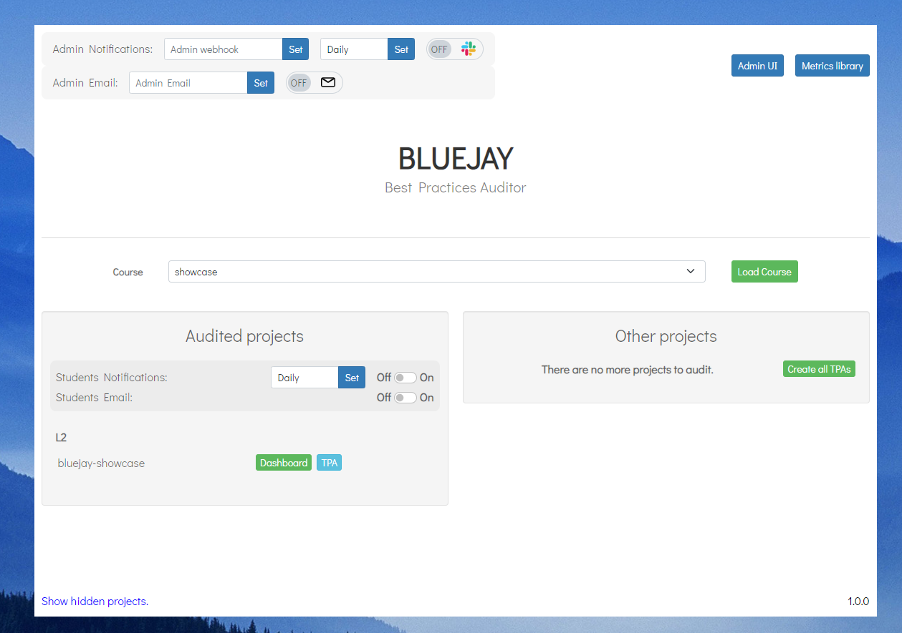
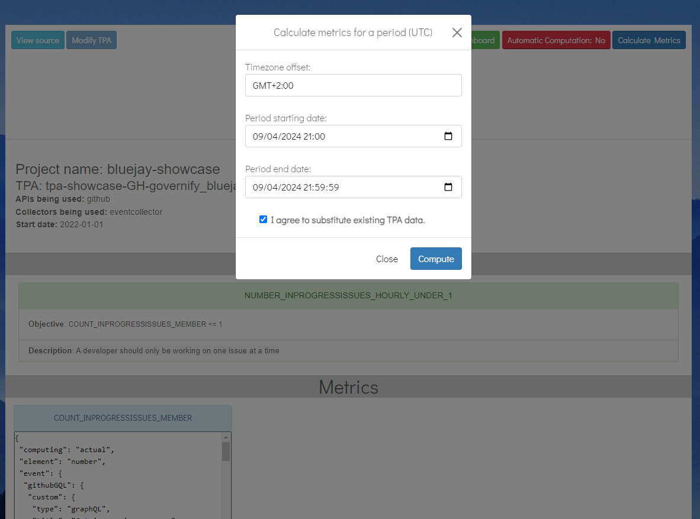
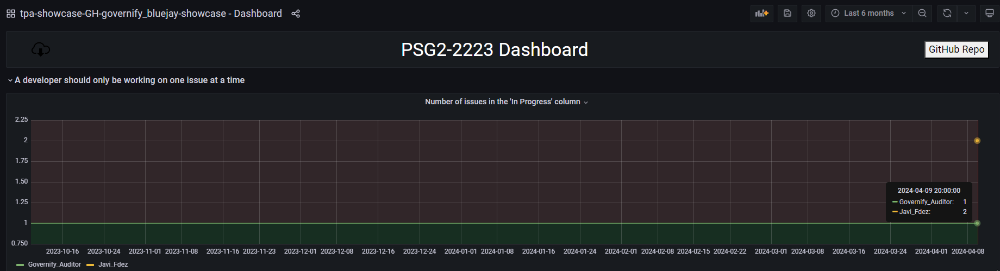

# TPA Creation Quickstart

---

For more information about how to create a TPA visit our documentation on [TPA configurations](./customization/agreement-modeling/team-practices-agreements)

## Prerequisites
This tutorial will be done with the [bluejay-showcase](https://github.com/governify/bluejay-showcase) test project created in the [docker-compose local quickstart](./deployment/docker-compose-local-quickstart)
 

## Creating a new TPA for the project
Open an API calling tool like Postman or ThunderClient. Select the `POST` method and enter the following URI:
```
localhost:5400/api/v6/agreements
```
In the body options choose the raw JSON option and introduce this TPA into the body:
```json
{
    "id": "tpa-showcase-GH-governify_bluejay-showcase",
    "version": "1.0.0",
    "type": "agreement",
    "context": {
        "validity": {
            "initial": "2022-01-01",
            "timeZone": "America/Los_Angeles"
        },
        "definitions": {
            "schemas": {},
            "scopes": {
                "development": {
                    "project": {
                        "name": "Project",
                        "description": "Project",
                        "type": "string",
                        "default": "showcase-GH-governify_bluejay-showcase"
                    },
                    "class": {
                        "name": "Class",
                        "description": "Group some Projects",
                        "type": "string",
                        "default": "showcase"
                    },
                    "member": {
                        "name": "Member",
                        "description": "Member",
                        "type": "string",
                        "default": "*"
                    }
                }
            },
            "collectors": {
                "eventcollector": {
                    "infrastructurePath": "internal.collector.events",
                    "endpoint": "/api/v2/computations",
                    "type": "POST-GET-V1",
                    "config": {
                        "scopeManager": "http://host.docker.internal:5700/api/v1/scopes/development"
                    }
                }
            },
            "dashboards": {
                "main": {
                    "base": "http://host.docker.internal:5200/api/v1/public/grafana-dashboards/tpa/base.json",
                    "modifier": "http://host.docker.internal:5200/api/v1/public/grafana-dashboards/tpa/modifier.js",
                    "overlay": "http://host.docker.internal:5200/api/v1/public/grafana-dashboards/tpa/overlay.js",
                    "config": {
                        "configDashboard": true,
                        "blocks": {
                            "0": {
                                "type": "divider-github-states",
                                "config": {
                                    "title": "CS105 2023 Dashboard"
                                }
                            },
                            "1": {
                                "type": "time-graph2-member",
                                "guarantee": "NUMBER_INPROGRESSISSUES_HOURLY_UNDER_1",
                                "config": {
                                    "scope-class": "showcase",
                                    "time-graph-title": "Number of issues in the 'In Progress' column"
                                }
                            }
                        }
                    },
                    "notifications": {}
                },
                "infrastructure": {}
            }
        }
    },
    "terms": {
        "metrics": {
            "COUNT_INPROGRESSISSUES_MEMBER": {
                "collector": {
                    "infrastructurePath": "internal.collector.events",
                    "endpoint": "/api/v2/computations",
                    "type": "POST-GET-V1",
                    "config": {
                        "scopeManager": "http://host.docker.internal:5700/api/v1/scopes/development"
                    }
                },
                "measure": {
                    "computing": "actual",
                    "element": "number",
                    "event": {
                        "githubGQL": {
                            "custom": {
                                "type": "graphQL",
                                "title": "Get issues in progress",
                                "steps": {
                                    "0": {
                                        "type": "queryGetObject",
                                        "query": "{repository(name: \"%PROJECT.github.repository%\", owner: \"%PROJECT.github.repoOwner%\") {\r\n    projectsV2(first: 5) {\r\n      nodes {\r\n        items(first: 100) {\r\n          nodes {\r\n            content {\r\n              ... on Issue {\r\n                bodyText\r\n                updatedAt\r\n                number\r\n                author {\r\n                  login\r\n                }\r\n                assignees(first: 5  ) {\r\n                    nodes {\r\n                        login\r\n                    }\r\n                }\r\n              }\r\n            }\r\n            fieldValues(first: 100) {\r\n              nodes {\r\n                ... on ProjectV2ItemFieldUserValue {\r\n                    field {\r\n                        ... on ProjectV2Field {\r\n                            name\r\n                        }\r\n                    }\r\n                }\r\n                ... on ProjectV2ItemFieldRepositoryValue {\r\n                  field {\r\n                    ... on ProjectV2Field {\r\n                      name\r\n                    }\r\n                  }\r\n                  repository {\r\n                    nameWithOwner\r\n                  }\r\n                }\r\n                ... on ProjectV2ItemFieldTextValue {\r\n                  text\r\n                  field {\r\n                    ... on ProjectV2Field {\r\n                      name\r\n                    }\r\n                  }\r\n                }\r\n                ... on ProjectV2ItemFieldMilestoneValue {\r\n                    field {\r\n                        ... on ProjectV2Field {\r\n                            name\r\n                        }\r\n                    }\r\n                    milestone {\r\n                        number\r\n                        title \r\n                    }\r\n                }\r\n                ... on ProjectV2ItemFieldSingleSelectValue {\r\n                  name\r\n                  updatedAt\r\n                  creator {\r\n                    login\r\n                  }\r\n                  field {\r\n                    ... on ProjectV2SingleSelectField {\r\n                      name\r\n                    }\r\n                  }\r\n                }\r\n              }\r\n            }\r\n          }\r\n        }\r\n      }\r\n    }\r\n  }\r\n}",
                                        "cache": true
                                    },
                                    "1": {
                                        "type": "objectGetSubObjects",
                                        "location": "data.repository.projectsV2.nodes.0.items.nodes"
                                    },
                                    "2": {
                                        "type": "objectsFilterObjects",
                                        "filters": [
                                            "content.assignees.nodes.0.login == '%MEMBER.github.username%'"
                                        ]
                                    },
                                    "3": {
                                        "type": "runScript",
                                        "variables": {},
                                        "script": "module.exports.generic = function getFieldValues(inputData, variables) {\r\n    let result = [];\r\n    for (const issue of inputData) {\r\n        for (const fieldValue of issue.fieldValues.nodes) {\r\n            if (fieldValue.name === 'In Progress') {\r\n                               result.push(issue);\r\n                \r\n            }\r\n        }\r\n    }\r\n    return result;\r\n}"
                                    }
                                }
                            }
                        }
                    },
                    "scope": {
                        "project": {
                            "name": "Project",
                            "description": "Project",
                            "type": "string",
                            "default": "showcase-GH-governify_bluejay-showcase"
                        },
                        "class": {
                            "name": "Class",
                            "description": "Group some Projects",
                            "type": "string",
                            "default": "showcase"
                        }
                    }
                }
            }
        },
        "guarantees": [
            {
                "id": "NUMBER_INPROGRESSISSUES_HOURLY_UNDER_1",
                "notes": "#### Description\r\n```\r\nTP-1: At most 1 in progress issue every hour.",
                "description": "A developer should only be working on one issue at a time",
                "scope": {
                    "project": {
                        "name": "Project",
                        "description": "Project",
                        "type": "string",
                        "default": "showcase-GH-governify_bluejay-showcase"
                    },
                    "class": {
                        "name": "Class",
                        "description": "Group some Projects",
                        "type": "string",
                        "default": "showcase"
                    },
                    "member": "*"
                },
                "of": [
                    {
                        "scope": {
                            "project": "showcase-GH-governify_bluejay-showcase",
                            "member": "*"
                        },
                        "objective": "COUNT_INPROGRESSISSUES_MEMBER <= 1",
                        "with": {
                            "COUNT_INPROGRESSISSUES_MEMBER": {}
                        },
                        "window": {
                            "type": "static",
                            "period": "hourly",
                            "initial": "2022-01-01"
                        }
                    }
                ]
            }
        ]
    }
}
```

This TPA provides information about the number of issues in progress that the members of the repository have. The API call in `Postman` should look like this:



You have now created the TPA for the test project. This is what you will see in the user interface. It is time to compute this TPA to see how the work team is performing.



## Computing the TPA
From the user interface, we click on the TPA button in the project and access the TPA details. In this new menu we click on Calculate Metrics. We enter the time and date you are currently on (take into account the time zone) and click on compute.



Now you must wait about 10 seconds or access the reporter logs, which will notify you when the elements have been inserted into the graphs.

Then access the dashboard with the following credentials:
- User: **governify-admin**
- Password: **governify-project** 

And see the information that has been generated according to the data from the github repository



